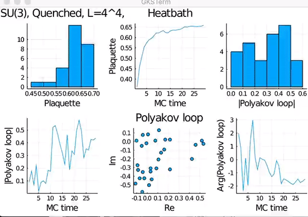
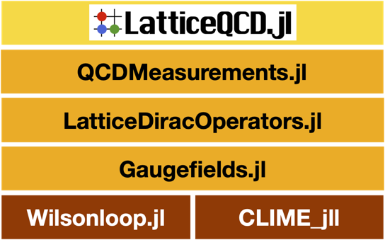

# LatticeQCD.jl 


[](https://github.com/akio-tomiya/LatticeQCD.jl/actions/workflows/CI.yml)


This code enabales you to perform lattice QCD calculations! A native Julia code for Lattice QCD.

- [What is lattice QCD? (PDG)](https://pdg.lbl.gov/2019/reviews/rpp2018-rev-lattice-qcd.pdf) : Lattice regulated quantum chromo-dynamics used in high energy physics.

- [What is Julia?](https://julialang.org/) : An easy and fast scientific programming launguage with the JIT compiler



## Star History

[](https://star-history.com/#akio-tomiya/LatticeQCD.jl&Date)


## Tutorial

You can start it in [Google Colab](https://colab.research.google.com/drive/1dMD7Uo-Z5SjK_LLHq9HkunQajXTXCE-L?usp=sharing)


# Quick start

You can start lattice QCD in 5 steps!


1.Download a Julia binary from [Julialang.org](https://julialang.org/downloads/). Set a path to the binary of Julia. 
Julia 1.6 (or higher) is supported. 
Julia 1.10 (or higher) is supported in LatticeQCD.jl 1.2.0 (or higher). 


2.In Julia REPL, push "]" key to enter the package mode and type

```
add LatticeQCD
```
and "return" key. Press "backspace" key ( "delete" key for mac) to exit the package mode.
You can get the latest version via ``add LatticeQCD#master``.

(All dependence will be solved automatically)


3.Include the package with

```
using LatticeQCD
```


4.Make a parameter file with wizard,

```
run_wizard()
```

Choose parameters as you want!


5.Start simulation with created your parameter file!

```
 run_LQCD("my_parameters.toml")
```

You'll get results!

Of cource, you can write/modify a parameter file by yourself.

Enjoy life with lattice QCD.

To see our demonstration above, execute,
```julia
using Plots
using LatticeQCD 
demo()
```
it takes time before showing up the window.

# What is supported?

We support lattice gauge theory in 4 dimensional euclidean spacetime.

- Wizard for parameter files
- Gauge fields
  - Optimized SU(2), SU(3)
  - General SU(N)
  - General gauge action = plaquette + rect + etc action
- Fermions
  - Wilson (2 flavor)
  - Staggered fermion (1-8 tastes ~ flavor)
  - Standard Domain-wall (2 flavor, experimental)
- Configuration generation algorithms
  - Cold/Hot start for SU(N). One instanton configuration for SU(2)
  - Heatbath for SU(N) & overelaxation for a general gauge action
  - Even-odd heatbath for the plaquette action
  - Quenched HMC with SU(N) for a general gauge action
  - HMC (2 flavor Wilson) with SU(N) with a general gauge action
  - HMC (4 taste staggered fermions) with SU(N) with a general gauge action
  - RHMC (any flavor staggered) with SU(N) for a general gauge action*
  - SU(N) stout smeared dynamical fermions (experimental)
  - Self-learning HMC with the plaquette action
- Measurements
  - Plaquette
  - Polyakov loop
  - Chiral condensates (Wilson, staggered)
  - Momentum projected pion correlator (Wilson fermion, staggered)
  - RxT Wilson loop
  - Energy density
  - Topological charge (plaquette, clover and O(a^2) improved definition)
  - Load & measurement mode (load and measure all configurations in a directory)
- Smearing
  - Stout
  - Gradient flow for a generic action (experimental)
- I/O for gauge configurations
  - ILDG format (Binary)
  - JLD format (Default binary file for Julia, one of HDF5)
  - Text file for Bridge++ (Bridgetext)

*If you specified other than Nf=4, 8 with the staggered fermion HMC, RHMC is automatically used. For a machine with the apple silicon, Nf=1-8 is avalable.

To use following functions, please use v 0.1.2
- Fermion integrated HMC with a general gauge action
- Self-learning Monte-Carlo with a general action (ref. [this paper](https://arxiv.org/abs/2010.11900) )


*Version below 1.0, it uses ``***.jl`` as a default parameter file, and now it uses ``***.toml``. Version 1.0 supports both parameter file formats.

*Parallelazation is supported by [LatticeDiracOperators.jl](https://github.com/akio-tomiya/LatticeDiracOperators.jl). See below.

# Related packages



LatticeQCD.jl is basically a wrapper of the following packages
- [Wilsonloop.jl](https://github.com/akio-tomiya/Wilsonloop.jl) :Wilsonloop.jl helps us to treat with the Wilson loops and generic Wilson lines in any Nc and dimensions. Wilson lines can be defined in symbolly.
- [Gaugefields.jl](https://github.com/akio-tomiya/Gaugefields.jl): Gaugefields.jl is a package for lattice lattice SU(N) gauge fileds. Treating gauge fields (links), gauge actions with MPI and autograd. This can generate quenched configurations.
- [LatticeDiracOperators.jl](https://github.com/akio-tomiya/LatticeDiracOperators.jl): LatticeDiracOperators.jl is a package for Dirac operators and fermions on the lattice. Treating pseudo-femrion fields with various lattice Dirac operators, fermion actions with MPI. This can generate configurations with dynamical fermions.
- [QCDMeasurements.jl](https://github.com/akio-tomiya/QCDMeasurements.jl): QCDMeasurements.jl is a package for measuring physical quantities. This has measurements for basic quantities like chiral condensates, plaquettes. Moreover, pion correlators and topological charge with several definitions. This also has the gradient flow with several actions.

This package is a code in a project [JuliaQCD](https://github.com/JuliaQCD/).

# USAGE/User interface

We support following two user interfaces

1. Julia REPL interface (For beginners, just after the lattice QCD textbook)
2. Genral interface (Experience with another code, for batch job, customised purpose)

Usage 1 was already explained. 

For Usage 2, in Julia REPL, push "]" key to enter the package mode and type

```
add LatticeQCD
```
Then, LatticeQCD.jl is installed on your machine. 

The "PARAMETER_FILE" can be created through the wizard. To use the wizard on the shell, you write the following code (& save as ``wizard.jl``): 

```julia:wizard.jl
using LatticeQCD
run_wizard()
```

Then, you can run the wizard:

```
julia wizard.jl
```

You write the following code (& save as ``run.jl``):
```julia:run.jl
using LatticeQCD
run_LQCD(ARGS[1])
```

Then, you can execute like

```
julia run.jl PARAMETER_FILE
```

then, you get results though standard I/O. 

# Purpose of the code
We develop this code to achive following things:

1. Good portability (If one has Julia, this code is runnable. All dependences are under control.)
2. Easy to start/ pedagogical (start in 10 minutes)
3. Suite (configuration generation with and without fermions, and measurements)
4. Easy to modify (Good for prototyping)
5. Compatitive speed with Fortran 90 codes

This is the first open source Julia code for lattice QCD. High performance is out of our scope.

# How has it been tested?

We compared results to following papers/codes 

- Nf=4 SU(3) staggered HMC with https://inspirehep.net/literature/283285
- Quenched SU(2) improved thermodynamics https://inspirehep.net/literature/1614325
- RHMC https://doi.org/10.1051/epjconf/201817507041
- HMC for Wilson and Clover Wilson fermions "Lattice Tool Kit":  https://nio-mon.riise.hiroshima-u.ac.jp/LTK/ 
- Pion correlator with the Wilson-Dirac operator https://inspirehep.net/literature/37901
- Pion correlator with the staggered Dirac operator https://inspirehep.net/literature/21821
- Domain-wall femrion https://inspirehep.net/literature/496758 fig4

# Reference

We refer "Lattice Tool Kit" https://nio-mon.riise.hiroshima-u.ac.jp/LTK/ written in Fortran 90.

# Acknowledgement
If you write a paper using this package, please refer this code.

E.g. This work is in part based on LatticeQCD.jl (https://github.com/akio-tomiya/LatticeQCD.jl).

BibTeX citation is following
```
@article{Nagai:2024yaf,
    author = "Nagai, Yuki and Tomiya, Akio",
    title = "{JuliaQCD: Portable lattice QCD package in Julia language}",
    eprint = "2409.03030",
    archivePrefix = "arXiv",
    primaryClass = "hep-lat",
    month = "9",
    year = "2024"
}
```
and the paper is [arXiv:2409.03030](https://arxiv.org/abs/2409.03030).
