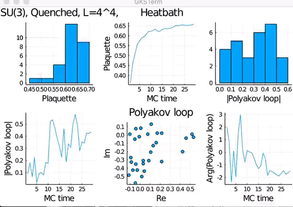
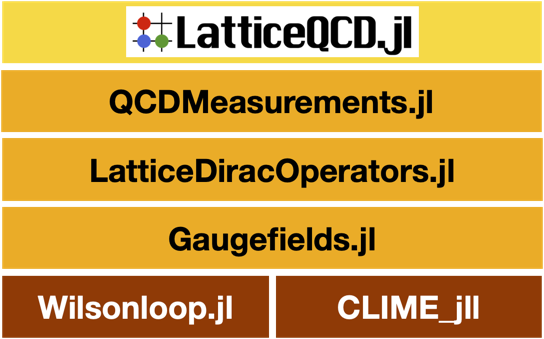

# LatticeQCD.jl 


[](https://github.com/akio-tomiya/LatticeQCD.jl/actions/workflows/CI.yml)


This code enabales you to perform lattice QCD calculations! A native Julia code for Lattice QCD.

LatticeQCD.jl v2 introduces a typed simulation workflow while retaining the
existing parameter files and legacy entry points.

- [What is lattice QCD? (PDG)](https://pdg.lbl.gov/2019/reviews/rpp2018-rev-lattice-qcd.pdf) : Lattice regulated quantum chromo-dynamics used in high energy physics.

- [What is Julia?](https://julialang.org/) : An easy and fast scientific programming launguage with the JIT compiler



## Q&A/Issues
If you have questions and comments. Please use the issues section of this repository or use [Discussions in JuliaQCD](https://github.com/orgs/JuliaQCD/discussions/2).

[In Japanese] 質問やコメントを日本語でしたい方は[JuliaQCDのディスカッションボード](https://github.com/orgs/JuliaQCD/discussions/7)に書き込みをしてください。

## Star History

[](https://star-history.com/#akio-tomiya/LatticeQCD.jl&Date)


## Tutorial

You can start it in [Google Colab](https://colab.research.google.com/drive/1dMD7Uo-Z5SjK_LLHq9HkunQajXTXCE-L?usp=sharing)

## What is new in v2?

- A typed, Param-free `SimulationSpec` and `SimulationSession` workflow for
  scripts, Jupyter notebooks, MPI/GPU runs, and future GUIs.
- A new `run_wizard()` with clearer simple/expert choices, review and back
  navigation. Existing TOML files, `run_LQCD`, and `run_wizard_legacy()` remain
  available.
- Unified typed execution for heatbath, HMC/RHMC, stout-smeared fermions,
  SLHMC, measurements, and gradient flow.
- Portable JLD2 configuration output and safe periodic restart checkpoints,
  including dynamical-fermion HMC state.
- Optional MPI loading and backend-neutral CPU/GPU setup; serial notebooks do
  not need to initialize MPI.

See [changes.md](changes.md) for the complete v2 changes, compatibility notes,
and validation coverage.


# Quick start

You can start lattice QCD in 5 steps!


1.Download a Julia binary from [Julialang.org](https://julialang.org/downloads/). Set a path to the binary of Julia. 
LatticeQCD.jl v2 supports Julia 1.11 and 1.12.


2.In Julia REPL, push "]" key to enter the package mode and type

```
add LatticeQCD
```
and "return" key. Press "backspace" key ( "delete" key for mac) to exit the package mode.
You can get the latest version via ``add LatticeQCD#master``.

(All dependence will be solved automatically)


3.Include the package with

```
using LatticeQCD
```


4.Make a parameter file and a typed `SimulationSpec` with the Param-free wizard,

```
spec = run_wizard()
session = build_simulation(spec, GaugefieldsEnvironment())
summary = run!(session)
```

The original Params-returning interface is available as
`run_wizard_legacy()` for compatibility and debugging.

`run!` prints rank-zero trajectory progress, HMC acceptance diagnostics,
measurements, configuration/checkpoint saves, and a final summary. Safe
restart checkpoints can be requested independently with
`JLD2CheckpointOutput("restart"; every=10)`; the Wizard asks for this interval
for HMC runs and explains that simple mode uses two-flavor Wilson fermions.
GUI and batch callers can retain event delivery while suppressing console
output with `run!(session; verbose=false)`.

Choose parameters as you want!


5.Start simulation with created your parameter file!

```
 run_LQCD("my_parameters.toml")
```

You'll get results!

Of cource, you can write/modify a parameter file by yourself.

Enjoy life with lattice QCD.

To see our demonstration above, execute,
```julia
using Plots
using LatticeQCD 
demo()
```
it takes time before showing up the window.

# What is supported?

We support lattice gauge theory in 4 dimensional euclidean spacetime.

- Wizard for parameter files
- Gauge fields
  - Optimized SU(2), SU(3)
  - General SU(N)
  - General gauge action = plaquette + rect + etc action
- Fermions
  - Wilson and Wilson–clover (2 flavor)
  - Staggered fermion (1-8 tastes ~ flavor)
  - HISQ fermion for SU(N) (1-8 tastes ~ flavor)
  - Standard and Möbius domain-wall (2 flavor, experimental)
- Configuration generation algorithms
  - Cold/Hot start for SU(N), one instanton for SU(2), and SU(2)-embedded instantons for SU(N)
  - Heatbath for SU(N) & overelaxation for a general gauge action
  - Even-odd heatbath for the plaquette action
  - Quenched HMC with SU(N) for a general gauge action
  - HMC (2 flavor Wilson) with SU(N) with a general gauge action
  - HMC (4 taste staggered fermions) with SU(N) with a general gauge action
  - RHMC (any flavor staggered) with SU(N) for a general gauge action*
  - HMC/RHMC with HISQ fermions for SU(N)
  - SU(N) stout smeared dynamical fermions (experimental)
  - Self-learning HMC with the plaquette action
- Measurements
  - Plaquette
  - Polyakov loop
  - Chiral condensates (Wilson, staggered)
  - Momentum projected pion correlator (Wilson fermion, staggered)
  - RxT Wilson loop
  - Energy density
  - Topological charge (plaquette, clover and O(a^2) improved definition)
  - Load & measurement mode (load and measure all configurations in a directory)
- Smearing
  - Stout
  - Gradient flow for a generic action (experimental)
- I/O for gauge configurations
  - ILDG format (Binary)
  - Portable JLD2 format (default typed-API output; one global configuration)
  - Text file for Bridge++ (Bridgetext)
  - Atomic, periodic JLD2 restart checkpoints at completed HMC trajectories

*If you specified other than Nf=4, 8 with the staggered fermion HMC, RHMC is automatically used. For a machine with the apple silicon, Nf=1-8 is avalable.

*Version below 1.0, it uses ``***.jl`` as a default parameter file, and now it uses ``***.toml``. Version 1.0 supports both parameter file formats.

*Parallelazation is supported by [LatticeDiracOperators.jl](https://github.com/akio-tomiya/LatticeDiracOperators.jl). See below.

## Optional MPI

MPI is an optional dependency in the new `Simulation` API. A serial notebook,
including a one-GPU run, can explicitly avoid MPI initialization:

```julia
using LatticeQCD
import Gaugefields

environment = GaugefieldsEnvironment(
    communicator=Gaugefields.SerialCommunicator(),
    process_grid=(1, 1, 1, 1),
)
```

The v2.0 release qualification covers serial CPU, one/two-rank CPU MPI, and a
single NVIDIA H100 using CUDA. MPI+CUDA multi-GPU, AMDGPU, and oneAPI use the
same backend-neutral JACC/LatticeMatrices path but are not yet release-tested;
they are experimental rather than claimed supported configurations. See the
[backend support matrix](docs/src/backends.md) for the tested fermions, I/O,
restart coverage, and the optional GPU command.

For a distributed run, install and load MPI explicitly, initialize it, and
pass its communicator:

```julia
using LatticeQCD
using MPI
MPI.Init()

environment = GaugefieldsEnvironment(
    communicator=MPI.COMM_WORLD,
    process_grid=(2, 2, 1, 1),
)
```

## Optional GPU backend

GPU selection remains an application-level choice, so importing LatticeQCD
does not initialize CUDA, AMDGPU, or oneAPI. Install JACC and the desired
backend package, select it once, and restart Julia. For CUDA:

```julia
using Pkg
Pkg.add(["JACC", "CUDA"])

using JACC
JACC.set_backend("cuda")
```

At the start of the restarted process or notebook, initialize the selected
backend before loading LatticeQCD:

```julia
using CUDA
import JACC
JACC.@init_backend

using LatticeQCD
import Gaugefields

environment = GaugefieldsEnvironment(
    communicator=Gaugefields.SerialCommunicator(),
    process_grid=(1, 1, 1, 1),
)
```

# Related packages



LatticeQCD.jl is basically a wrapper of the following packages
- [Wilsonloop.jl](https://github.com/akio-tomiya/Wilsonloop.jl) :Wilsonloop.jl helps us to treat with the Wilson loops and generic Wilson lines in any Nc and dimensions. Wilson lines can be defined in symbolly.
- [Gaugefields.jl](https://github.com/akio-tomiya/Gaugefields.jl): Gaugefields.jl is a package for lattice lattice SU(N) gauge fileds. Treating gauge fields (links), gauge actions with MPI and autograd. This can generate quenched configurations.
- [LatticeDiracOperators.jl](https://github.com/akio-tomiya/LatticeDiracOperators.jl): LatticeDiracOperators.jl is a package for Dirac operators and fermions on the lattice. Treating pseudo-femrion fields with various lattice Dirac operators, fermion actions with MPI. This can generate configurations with dynamical fermions.
- [QCDMeasurements.jl](https://github.com/akio-tomiya/QCDMeasurements.jl): QCDMeasurements.jl is a package for measuring physical quantities. This has measurements for basic quantities like chiral condensates, plaquettes. Moreover, pion correlators and topological charge with several definitions. This also has the gradient flow with several actions.

This package is a code in a project [JuliaQCD](https://github.com/JuliaQCD/).

# USAGE/User interface

We support following two user interfaces

1. Julia REPL interface (For beginners, just after the lattice QCD textbook)
2. Genral interface (Experience with another code, for batch job, customised purpose)

Usage 1 was already explained. 

For Usage 2, in Julia REPL, push "]" key to enter the package mode and type

```
add LatticeQCD
```
Then, LatticeQCD.jl is installed on your machine. 

The "PARAMETER_FILE" can be created through the wizard. To use the wizard on the shell, you write the following code (& save as ``wizard.jl``): 

```julia:wizard.jl
using LatticeQCD
spec = run_wizard()
```

Then, you can run the wizard:

```
julia wizard.jl
```

You write the following code (& save as ``run.jl``):
```julia:run.jl
using LatticeQCD
run_LQCD(ARGS[1])
```

Then, you can execute like

```
julia run.jl PARAMETER_FILE
```

then, you get results though standard I/O. 

# Purpose of the code
We develop this code to achive following things:

1. Good portability (If one has Julia, this code is runnable. All dependences are under control.)
2. Easy to start/ pedagogical (start in 10 minutes)
3. Suite (configuration generation with and without fermions, and measurements)
4. Easy to modify (Good for prototyping)
5. Compatitive speed with Fortran 90 codes

This is the first open source Julia code for lattice QCD. High performance is out of our scope.

# How has it been tested?

We compared results to following papers/codes 

- Nf=4 SU(3) staggered HMC with https://inspirehep.net/literature/283285
- Quenched SU(2) improved thermodynamics https://inspirehep.net/literature/1614325
- RHMC https://doi.org/10.1051/epjconf/201817507041
- HMC for Wilson and Clover Wilson fermions "Lattice Tool Kit":  https://nio-mon.riise.hiroshima-u.ac.jp/LTK/ 
- Pion correlator with the Wilson-Dirac operator https://inspirehep.net/literature/37901
- Pion correlator with the staggered Dirac operator https://inspirehep.net/literature/21821
- Domain-wall fermion https://inspirehep.net/literature/496758 fig4

# Reference

We refer "Lattice Tool Kit" https://nio-mon.riise.hiroshima-u.ac.jp/LTK/ written in Fortran 90.

# Acknowledgement
If you write a paper using this package, please refer this code.

E.g. This work is in part based on LatticeQCD.jl (https://github.com/akio-tomiya/LatticeQCD.jl).

BibTeX citation is following
```
@article{Nagai:2024yaf,
    author = "Nagai, Yuki and Tomiya, Akio",
    title = "{JuliaQCD: Portable lattice QCD package in Julia language}",
    eprint = "2409.03030",
    archivePrefix = "arXiv",
    primaryClass = "hep-lat",
    month = "9",
    year = "2024"
}
```
and the paper is [arXiv:2409.03030](https://arxiv.org/abs/2409.03030).
